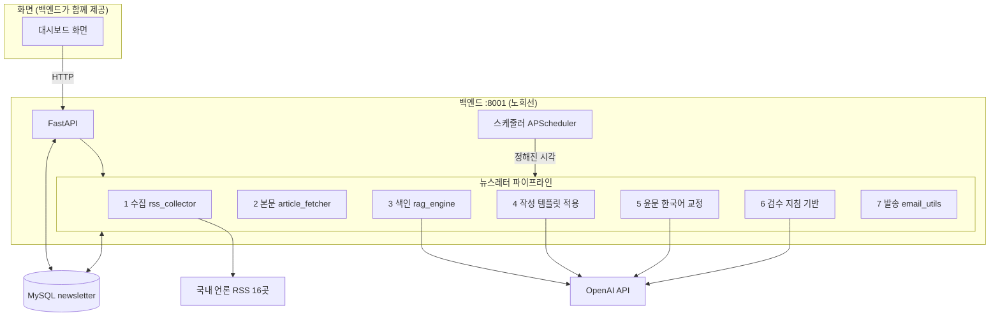
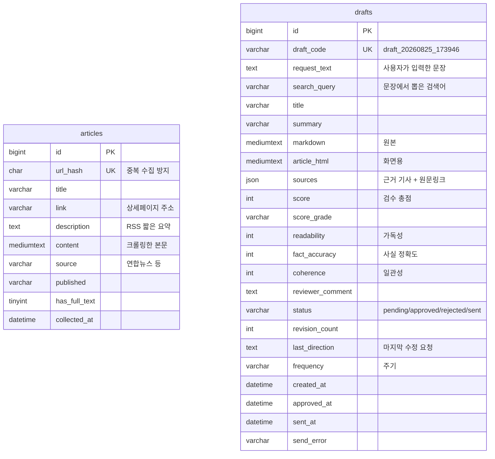
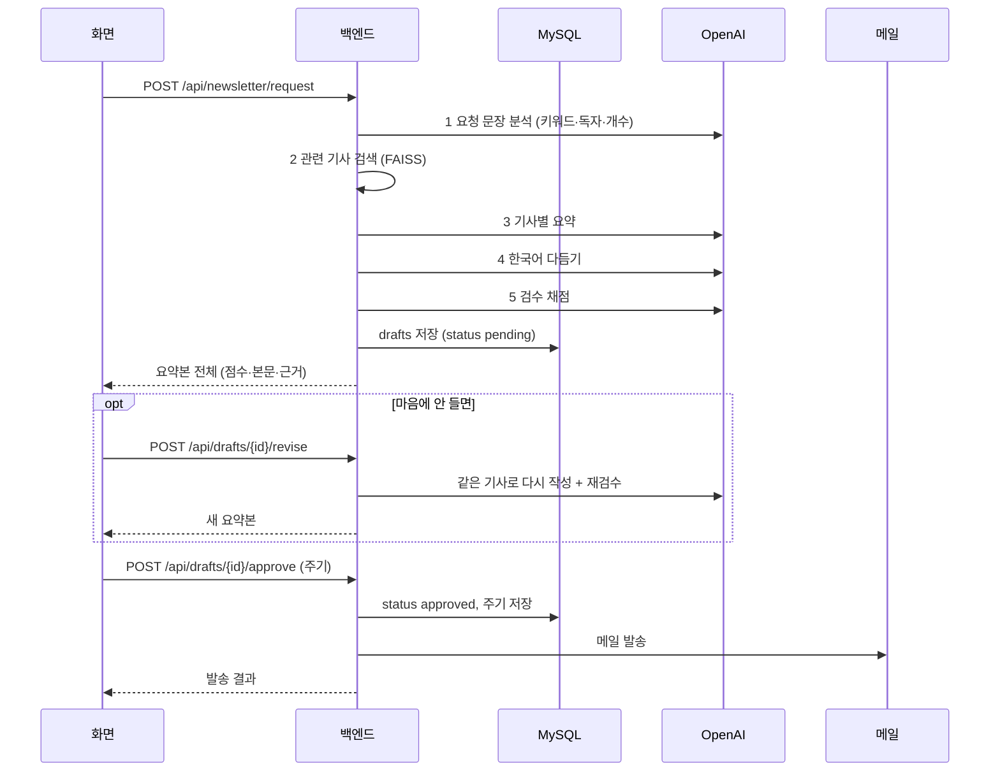
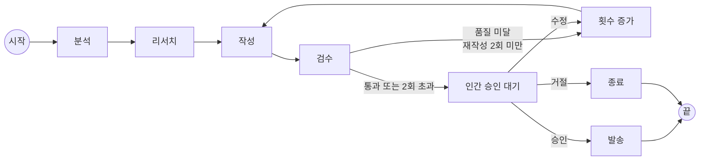
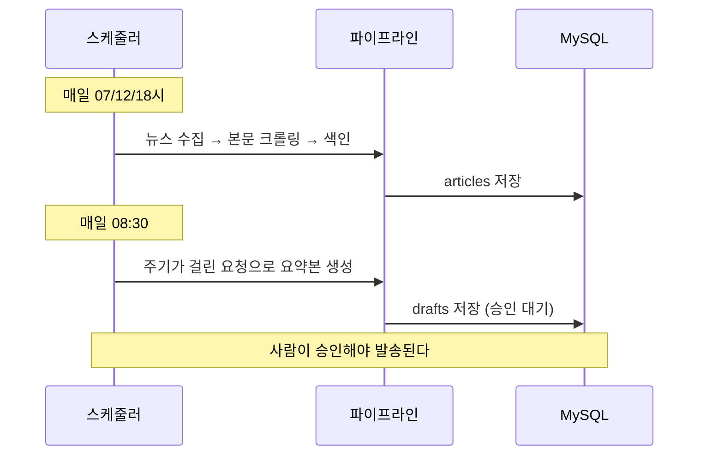

# 백엔드 설계서 — 뉴스레터 에이전트

작성일: 2026-08-25 · 담당: 노희선(백엔드) · 저장소: chois9105/mulcam

---

## 1. 회의 내용 정리

### 이미 끝난 것

| 회의 발언 | 상태 |
|---|---|
| "뉴스 RSS를 모아서 JSON으로 받아서 RAG를 쓰면 실제 응답이 나오는지 확인" | 완료 |
| "리서치를 할 수 있는지, 요약을 잘 해주는지 확인" | 완료 |
| "확인 후 깃허브에 넘김" | 완료 |
| "뉴스 RSS를 받아와서 요약할 때 뉴스 전체를 다 주는지?" | **안 준다**는 것을 확인 → 본문 크롤링 추가 (99% 성공) |
| "제목만 나오면 상세페이지로 넘어갈 수 없으니" | 원문 링크 보존. 구글뉴스는 리다이렉트라 제외 |
| "출력 형태는 a, b, c 3개" | brief / newsletter / deep 3종 구현 |

### 새로 정해진 것 (이번 회의)

| 회의 발언 | 해석 | 영향 |
|---|---|---|
| **"DB 사용함. MySQL을 사용함"** | 저장소를 MySQL로 확정 | 앞서 검토한 JSON 파일안은 **폐기**. 전면 재설계 |
| "사용자가 이 템플릿으로 해줘" | 사용자가 템플릿을 골라 뉴스레터를 받는다 | 템플릿 선택 기능 |
| "정해진 시간에 맞춰서 그 템플릿에 맞춰 뉴스를 인출" | 예약 발송 | 스케줄러 |
| "템플릿 형태를 MySQL에 저장" | 템플릿이 DB 데이터 | `templates` 테이블 |
| "파이썬 파일 안에 기본 템플릿 3개를 저장해둔다" | 코드에 기본값, DB에 실사용본 | 시드(seed) 방식 |
| **"요약되어 나온 한국어가 이상한 부분을 고쳐서 이쁘게"** | 윤문 단계 신설 | 파이프라인에 **교정 단계 추가** |
| **"지침을 줘서 참고해서 검수할 때 이럴 때 이렇게 해라"** | 검수 기준을 바꿀 수 있게 | `review_guidelines` 테이블 |

> **핵심 변경 2가지**
>
> 1. 저장소가 **MySQL**로 확정됐다. 지금은 초안·키워드가 메모리에만 있어 서버를 끄면 사라진다.
> 2. 파이프라인에 **한국어 윤문**과 **지침 기반 검수**가 새로 들어간다.

---

## 2. 전체 구조



### 파이프라인 7단계

| 단계 | 하는 일 | 상태 |
|---|---|---|
| 1. 수집 | 국내 언론 16곳 RSS → JSON | 완료 |
| 2. 본문 | 링크를 따라가 기사 본문 추출 (RSS는 60자만 줌) | 완료 |
| 3. 색인 | 임베딩 → FAISS 검색 | 완료 |
| 4. 작성 | 기사별 제목 + 한두 문장으로 요약 | 완료 |
| 5. 윤문 | 어색한 한국어 교정 | 완료 (`polisher.py`) |
| 6. 검수 | 별도 모델이 채점 | 완료 (`reviewer.py`) |
| 7. 발송 | 승인된 것만 이메일 | 완료 (`mailer.py`) |

---

## 3. ERD (MySQL 테이블 설계) — 2개

> **2026-08-25 변경.** 처음에는 10개로 설계했으나
> "아주 간단하게 만든다"는 방침에 따라 2개로 줄였다.
>
> | 뺀 것 | 이유 |
> |---|---|
> | `subscribers` `keywords` | 로그인 기능이 없다 |
> | `dispatch_logs` | 수신자가 한 명이다. `.env` 의 `MAIL_TO` 한 줄로 충분 |
> | `schedules` | 주기가 요약본마다 하나뿐이라 `drafts` 컬럼으로 흡수 |
> | `templates` `review_guidelines` | 출력 형태와 검수 지침이 각각 하나뿐이라 코드 상수로 충분 |
> | `audit_reports` `draft_sources` | 요약본 하나에 하나씩이라 `drafts` 안으로 흡수 |



### 두 테이블의 역할

| 테이블 | 역할 |
|---|---|
| `articles` | 언론사에서 모아온 기사와 크롤링한 본문. 중복 수집을 막는다 |
| `drafts` | 만들어진 요약본. 검수 점수·근거 기사·주기·발송 결과까지 한 곳에 |

`articles` 와 `drafts` 사이에 연결 테이블을 두지 않았다.
근거 기사는 화면에 그대로 뿌리기만 하므로 `drafts.sources` JSON 한 칸이면 충분하다.

### 수신자

로그인이 없고 한 사람에게만 보내므로 DB 를 쓰지 않는다.

```
# backend/.env
MAIL_TO=받는사람@example.com
MAIL_DRY_RUN=true      # true 면 실제로 보내지 않고 기록만 남긴다
```

---

## 4. 출력 형태 — 기사 간단 요약 하나

> **2026-08-25 회의에서 변경.** 처음에는 a/b/c 3종이었으나,
> **`a. 기사 간단 요약` 하나만** 쓰기로 정했다.

기사를 뭉뚱그리지 않고 **한 기사당 한 항목**으로 정리한다.
화면 ③의 설명 "선택한 뉴스의 제목과 핵심 요약만 compact하게 보여줍니다" 와 맞춘 것이다.

```markdown
# 생성형 AI와 LangGraph 관련 기사 요약

**공공 현안 해결할 AI 찾는다…정부, 민간 경진대회 개최** [1]
정부가 교통사고 분석, 딥보이스 탐지 등 사회문제 해결을 위해 민간 AI
전문가들의 기술과 아이디어를 활용하는 경진대회를 개최한다.

**배경훈 "AI 모델은 국가 안보"…독자 AI 글로벌 톱티어 도전** [2]
정부는 독자 AI 모델을 세계 최고 수준으로 고도화하고, 내년에는 최상위급
프론티어 AI 모델 개발에 도전할 계획이다.
```

`[1]` `[2]` 번호는 응답의 `sources` 와 이어지고, 거기에 원문 링크가 있다.
사용자가 기사 상세페이지로 바로 갈 수 있다.

### 이 변경으로 줄어든 작업

| 원래 계획 | 지금 |
|---|---|
| `templates` 테이블에 3종 저장 + CRUD | 1종뿐이라 코드 상수로 충분 |
| 요청 문장에서 출력 형태 판별 | 불필요 — 항상 하나 |
| 화면에서 템플릿 고르기 | 불필요 |

> 나머지 두 형태(짧은 브리핑 / 심층 분석)의 코드는 지우지 않고
> `rag_engine.py` 에 `"사용": False` 로 꺼두었다. 필요해지면 한 줄로 살아난다.

---

## 5. API 엔드포인트 (3개)

> **2026-08-26 갱신.** 실제 구현·배포된 경로다.
> 팀장 요청에 따라 모든 경로는 `/api` 로 시작한다.
> 요청·응답 형식은 **API_SPEC.md** 에 있다.

| # | 화면 버튼 | 엔드포인트 | 본문 |
|---|---|---|---|
| 1 | 🚀 뉴스레터 요청 | `POST /api/newsletter/request` | `{ request_text }` |
| 2 | ↺ 수정 요청 | `POST /api/drafts/{draft_id}/revise` | `{ direction }` |
| 3 | ✅ 최종 승인 | `POST /api/drafts/{draft_id}/approve` | `{ frequency }` |

조회용

| 메서드 | 경로 | 용도 |
|---|---|---|
| GET | `/api/drafts` | 목록 (② 드롭다운, ③ 카드) |
| GET | `/api/drafts/{draft_id}` | 상세 |
| GET | `/api/status` | 저장소·스케줄러 상태 |
| POST | `/api/news/collect` | 뉴스 수집 수동 실행 (평소엔 스케줄러) |

LangGraph (과제 요구사항 시연용)

| 메서드 | 경로 | 용도 |
|---|---|---|
| POST | `/api/graph/start` | 실행 → 인간 승인 노드에서 중단 |
| POST | `/api/graph/{thread_id}/resume` | approve / revise / reject 로 재개 |
| GET | `/api/graph/{thread_id}` | 지금 멈춰 있는 노드 확인 |

### 설계 원칙

1. **사용자가 누르는 버튼 하나 = 엔드포인트 하나.** 화면에 없는 기능은 만들지 않는다.
2. **내부 단계는 엔드포인트로 만들지 않는다.** 파이프라인이 여러 단계라고 해서
   프론트가 여러 번 호출하게 하면 순서와 실패 처리를 프론트가 떠안게 된다.
   프론트는 "무엇을 원하는지"만 말하고, "어떻게 하는지"는 백엔드가 감춘다.
3. **응답에 요약본 전체를 담는다.** 제목·요약·점수·본문 HTML·검수 결과·근거 기사를
   한 번에 주므로 화면이 추가로 물어볼 일이 없다.
4. **느린 일은 뒤로 뺀다.** 기사 수집·색인은 1~2분 걸리므로 스케줄러가 미리 돌린다.
   요청 버튼은 10~20초 안에 응답한다.

### 수정과 승인을 나눈 이유

처음에는 하나로 묶으려 했으나, 화면에 **[수정 요청]** 과 **[최종 승인]** 버튼이
따로 있고 주기 선택이 승인 옆에 붙어 있어 두 개로 나눴다.

---

## 6. 주요 흐름

### 뉴스레터 요청 → 승인 → 발송



### LangGraph 파이프라인 (과제 요구사항)



**인간 승인 대기**에서 그래프가 멈춘다. 상태는 체크포인트에 저장되고,
사람이 버튼을 누르면 그 자리에서 이어서 실행된다.

### 자동 실행



---

## 7. 현재 상태

| 단계 | 상태 | 확인 방법 |
|---|---|---|
| 뉴스 수집 (16개 매체) | 완료 | 한 번에 135~181건 |
| 기사 본문 크롤링 | 완료 | 성공률 99~100% |
| RAG 색인·검색 | 완료 | `rag_engine.py` |
| 요청 문장 분석 | 완료 | `request_analyzer.py` |
| 기사별 요약 | 완료 | 근거 번호 부착 |
| 한국어 다듬기 | 완료 | `polisher.py` |
| 검수 채점 | 완료 | 실제로 감점함 |
| LangGraph 순환·중단 | 완료 | 중단→수정→승인 검증 |
| MySQL 저장 | 완료 | 재시작 후에도 유지 |
| 메일 발송 | 완료 | 실제 발송 성공 |
| 자동 실행 | 완료 | 07/12/18시, 08:30 |
| 화면 | 완료 | `backend/static/index.html` |

### 남은 일 (팀)

| 할 일 | 담당 |
|---|---|
| 중복 코드 정리 (`newsletter_m1.py` vs `backend/`) | 팀 |
| 화면 담당 확정 — 배포된 Streamlit 이 아직 가짜 데이터를 씀 | 팀 |
| 배포·마무리 | 팀장 |

---

## 8. 팀원과 합의할 것

| # | 대상 | 내용 |
|---|---|---|
| 1 | 프론트(dynapark-yj) | 백엔드가 `/api/*` 경로를 그대로 제공한다. 주소만 `:8001`로 바꾸면 되는지 |
| 2 | 프론트 | `agent_graph.py`의 하드코딩 데이터를 백엔드 호출로 교체 |
| 3 | moonlight | `newsletter.py`의 검수 채점 기준을 차용했다 (공유) |
| 4 | 전체 | MySQL 접속 정보(호스트/계정/DB명)를 어떻게 공유할지 |
| 5 | 전체 | 발표 시연에서 예약 발송까지 보여줄지, 수동 실행으로 할지 |
