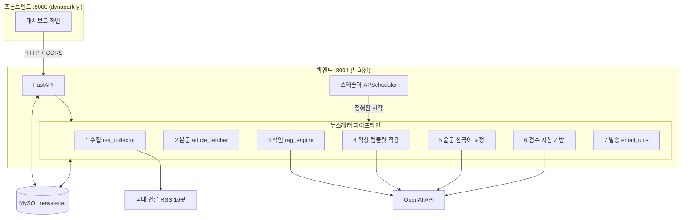
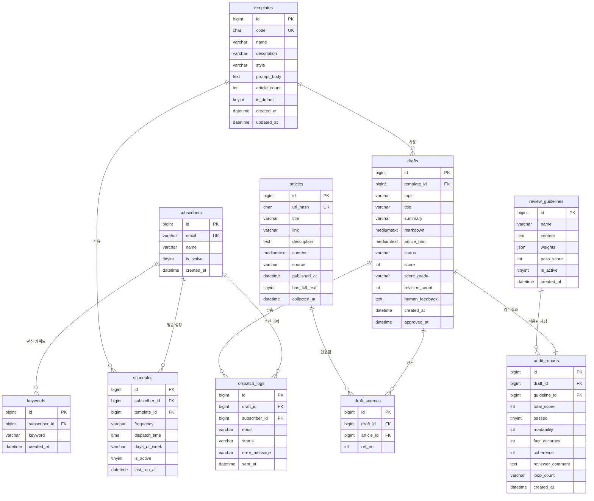
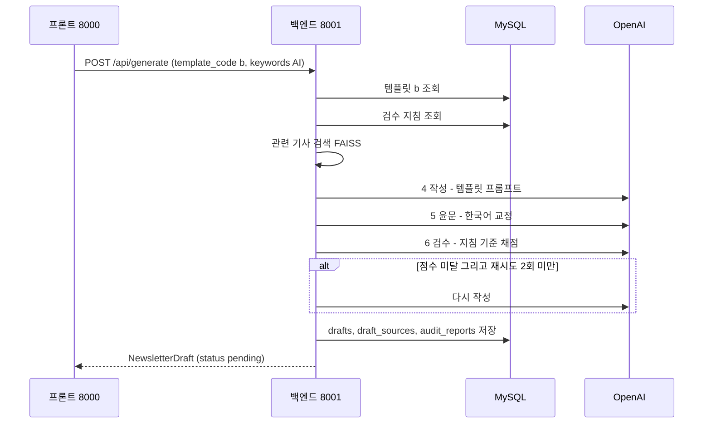
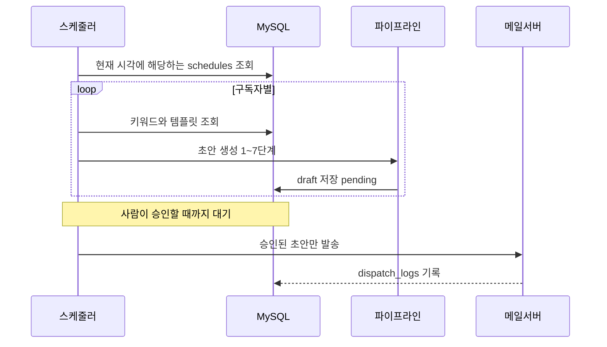

# 백엔드 설계서 — 뉴스레터 에이전트

작성일: 2026-08-25 · 담당: 노희선(백엔드) · 저장소: chois9105/mulcam

---

## 1. 회의 내용 정리

### 이미 끝난 것

| 회의 발언 | 상태 |
|---|---|
| "뉴스 RSS를 모아서 JSON으로 받아서 RAG를 쓰면 실제 응답이 나오는지 확인" | 완료 |
| "리서치를 할 수 있는지, 요약을 잘 해주는지 확인" | 완료 |
| "확인 후 깃허브에 넘김" | 완료 |
| "뉴스 RSS를 받아와서 요약할 때 뉴스 전체를 다 주는지?" | **안 준다**는 것을 확인 → 본문 크롤링 추가 (99% 성공) |
| "제목만 나오면 상세페이지로 넘어갈 수 없으니" | 원문 링크 보존. 구글뉴스는 리다이렉트라 제외 |
| "출력 형태는 a, b, c 3개" | brief / newsletter / deep 3종 구현 |

### 새로 정해진 것 (이번 회의)

| 회의 발언 | 해석 | 영향 |
|---|---|---|
| **"DB 사용함. MySQL을 사용함"** | 저장소를 MySQL로 확정 | 앞서 검토한 JSON 파일안은 **폐기**. 전면 재설계 |
| "사용자가 이 템플릿으로 해줘" | 사용자가 템플릿을 골라 뉴스레터를 받는다 | 템플릿 선택 기능 |
| "정해진 시간에 맞춰서 그 템플릿에 맞춰 뉴스를 인출" | 예약 발송 | 스케줄러 |
| "템플릿 형태를 MySQL에 저장" | 템플릿이 DB 데이터 | `templates` 테이블 |
| "파이썬 파일 안에 기본 템플릿 3개를 저장해둔다" | 코드에 기본값, DB에 실사용본 | 시드(seed) 방식 |
| **"요약되어 나온 한국어가 이상한 부분을 고쳐서 이쁘게"** | 윤문 단계 신설 | 파이프라인에 **교정 단계 추가** |
| **"지침을 줘서 참고해서 검수할 때 이럴 때 이렇게 해라"** | 검수 기준을 바꿀 수 있게 | `review_guidelines` 테이블 |

> **핵심 변경 2가지**
>
> 1. 저장소가 **MySQL**로 확정됐다. 지금은 초안·키워드가 메모리에만 있어 서버를 끄면 사라진다.
> 2. 파이프라인에 **한국어 윤문**과 **지침 기반 검수**가 새로 들어간다.

---

## 2. 전체 구조



### 파이프라인 7단계

| 단계 | 하는 일 | 상태 |
|---|---|---|
| 1. 수집 | 국내 언론 16곳 RSS → JSON | 완료 |
| 2. 본문 | 링크를 따라가 기사 본문 추출 (RSS는 60자만 줌) | 완료 |
| 3. 색인 | 임베딩 → FAISS 검색 | 완료 |
| 4. 작성 | **선택한 템플릿**으로 뉴스레터 생성 | 템플릿 DB 연결 필요 |
| 5. 윤문 | 어색한 한국어 교정 | **신규** |
| 6. 검수 | **지침**에 따라 채점 | 지침 DB 연결 필요 |
| 7. 발송 | 승인된 것만 이메일 | 수신자 연결 필요 |

---

## 3. ERD (MySQL 테이블 설계)



### 테이블 10개 요약

| 테이블 | 역할 | 회의 근거 |
|---|---|---|
| `subscribers` | 뉴스레터 받을 사람 | 발송 대상이 있어야 함 |
| `keywords` | 관심 키워드 | 프론트 `/api/keywords` |
| **`templates`** | 템플릿 3종 (a/b/c) | "템플릿 형태를 MySQL에 저장" |
| **`schedules`** | 언제 어떤 템플릿으로 보낼지 | "정해진 시간에 맞춰서" |
| `articles` | 수집한 기사 + 본문 | "뉴스 전체를 다 주는지" |
| `drafts` | 생성된 뉴스레터 | 승인 흐름 |
| `draft_sources` | 초안 ↔ 근거 기사 연결 | "상세페이지로 넘어갈 수 있게" |
| **`review_guidelines`** | 검수 지침 | "지침을 줘서 참고해서 검수" |
| `audit_reports` | 검수 점수 | 프론트 `AuditReport` |
| `dispatch_logs` | 발송 이력 | 실패 추적 |

---

## 4. 템플릿 3종 (a / b / c)

기본값은 **파이썬 파일**(`templates_seed.py`)에 두고, 서버가 처음 뜰 때 MySQL에 넣는다.
사용자가 수정하면 MySQL 값이 우선한다.
(회의: "사용자 추천을 받은 파이썬 파일 안에 기본 템플릿을 저장해둔다. 3개 정도")

| 코드 | 이름 | 형식 | 참고 기사 |
|---|---|---|---|
| **a** | 짧은 브리핑 | 한 줄 + 핵심 3가지, 200자 이내 | 5건 |
| **b** | 표준 뉴스레터 | 이슈 3~5개 (소제목 + 설명) + 오늘의 한 줄 | 8건 |
| **c** | 심층 분석 | 무슨 일이 / 왜 중요한가 / 함께 볼 흐름 / 참고 기사 | 12건 |

> 이미 만들어 둔 `brief` / `newsletter` / `deep` 이 각각 a / b / c 다.
> 코드에 박혀 있는 것을 DB로 옮기기만 하면 된다.

---

## 5. API 엔드포인트 (23개)

### 설계 원칙

1. **느린 것과 빠른 것을 나눈다** — 수집·색인(1~2분)은 `/collect`로 분리, 생성·조회는 즉시 응답
2. **프론트 경로 규약을 따른다** — 프론트가 이미 쓰는 `/api/*` 이름을 그대로 맞춘다
3. **자원 단위로 묶는다** — 템플릿·구독자·초안 각각 CRUD

### CRUD 매트릭스

| 자원 | Create | Read | Update | Delete |
|---|---|---|---|---|
| **템플릿** | `POST /api/templates` | `GET /api/templates`<br>`GET /api/templates/{id}` | `PUT /api/templates/{id}` | `DELETE /api/templates/{id}` |
| **구독자** | `POST /api/subscribers` | `GET /api/subscribers` | `PUT /api/subscribers/{id}` | `DELETE /api/subscribers/{id}` |
| **키워드** | `POST /api/keywords` | `GET /api/keywords` | — | `DELETE /api/keywords/{keyword}` |
| **스케줄** | `POST /api/schedule` | `GET /api/schedule` | `PUT /api/schedule/{id}` | `DELETE /api/schedule/{id}` |
| **뉴스** | `POST /api/news/collect` | `GET /api/news`<br>`GET /api/news/{id}` | — | — |
| **초안** | `POST /api/generate` | `GET /api/drafts`<br>`GET /api/drafts/{id}` | `POST /api/drafts/{id}/revise` | `DELETE /api/drafts/{id}` |
| **검수지침** | `POST /api/guidelines` | `GET /api/guidelines` | `PUT /api/guidelines/{id}` | — |
| **발송** | `POST /api/drafts/{id}/dispatch` | `GET /api/dispatch-logs` | — | — |

### 상태 변경 (CRUD로 표현되지 않는 것)

| 경로 | 하는 일 |
|---|---|
| `POST /api/drafts/{id}/approve` | 승인 → 발송 대기 |
| `POST /api/drafts/{id}/revise` | 피드백 주고 재작성 (Human-in-the-Loop) |
| `POST /api/drafts/batch-approve` | 여러 개 한번에 승인 |
| `POST /api/drafts/{id}/review` | 검수만 다시 실행 |
| `POST /api/research/ask` | 리서치 — 기사 근거 답변 |
| `GET /api/health` | 상태 확인 |

### 프론트엔드가 이미 부르고 있는 경로

프론트 `main.py`에 아래가 이미 있다.
**백엔드가 같은 경로를 제공하면, 프론트는 주소만 `:8001`로 바꾸면 된다.**

```
GET    /api/keywords              POST /api/keywords        DELETE /api/keywords/{keyword}
GET    /api/schedule              POST /api/schedule
GET    /api/drafts                GET  /api/drafts/{id}
POST   /api/generate
POST   /api/drafts/{id}/approve   POST /api/drafts/{id}/revise
POST   /api/drafts/batch-approve
```

---

## 6. 주요 흐름

### 초안 생성



### 예약 발송



---

## 7. 앞으로 할 일

| 순서 | 작업 | 산출물 | 난이도 |
|---|---|---|---|
| **1** | MySQL 연결 | `database.py`, `models_db.py` (SQLAlchemy) | 보통 |
| **2** | 테이블 생성 + 기본 템플릿 시드 | `templates_seed.py`, `init_db.py` | 쉬움 |
| **3** | 템플릿 CRUD | `/api/templates/*` | 쉬움 |
| **4** | 구독자·키워드 CRUD | `/api/subscribers/*`, `/api/keywords/*` | 쉬움 |
| **5** | 기사·초안을 DB에 저장 | 기존 메모리 코드를 DB로 이전 | 보통 |
| **6** | **한국어 윤문 단계** | `polisher.py` | 보통 |
| **7** | **지침 기반 검수** | `reviewer.py` 수정 + `/api/guidelines/*` | 보통 |
| **8** | 승인·수정 흐름 | `/api/drafts/{id}/approve`, `/revise` | 보통 |
| **9** | 이메일 발송 + 이력 | `/api/drafts/{id}/dispatch` | 보통 |
| **10** | 스케줄러 | APScheduler | 보통 |

### 추가로 설치할 것

```bash
pip install pymysql sqlalchemy apscheduler
```

> MySQL 8.4는 이 PC에 이미 설치돼 있다.
> 다만 `MYSQL84` 서비스가 **정지 상태**라 먼저 켜야 한다.

---

## 8. 팀원과 합의할 것

| # | 대상 | 내용 |
|---|---|---|
| 1 | 프론트(dynapark-yj) | 백엔드가 `/api/*` 경로를 그대로 제공한다. 주소만 `:8001`로 바꾸면 되는지 |
| 2 | 프론트 | `agent_graph.py`의 하드코딩 데이터를 백엔드 호출로 교체 |
| 3 | moonlight | `newsletter.py`의 검수 채점 기준을 차용했다 (공유) |
| 4 | 전체 | MySQL 접속 정보(호스트/계정/DB명)를 어떻게 공유할지 |
| 5 | 전체 | 발표 시연에서 예약 발송까지 보여줄지, 수동 실행으로 할지 |
